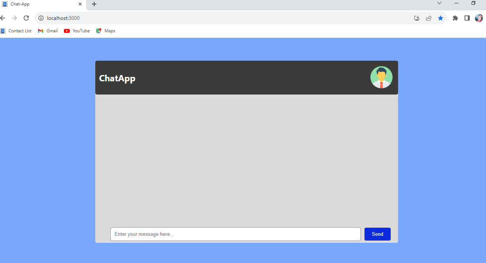
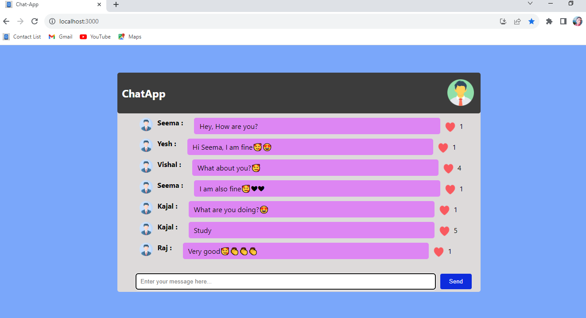

# Chap App
## Description
✍ A chat app allows users to exchange real-time messages, fostering instant communication and connections, often supporting multimedia elements for a richer interaction experience. It's a convenient tool for staying connected in today's digital age.

### Click the Go Live button and see the live👉 [Go Live](https://chat-app-lovely.netlify.app)

## Installation
- Install the required dependencies using npm install.
- Start the server using npm start.

# Folder Structure

   - ### public
   - ### src
        - #### Components
            - ##### InputArea
                - InputArea.js
                - InputArea.module.css
            - ##### MessageArea
                - MessageArea.js
                - MessageArea.module.css
            - ##### NavBar
                - NavBar.js
                - NavBar.module.css
        - #### Images
            - Screenshort Images
        - #### App.css
        - #### App.js
        - #### index.css
        - #### index.js
   - ### package
   - ### README.md

## Fatures

 - A simple group chat app, in which a user is generated randomly for sending messages.
 - The user can enter a message in the input box and send it to the chat.
 - The message will be displayed in the chat area, with the username and a heart icon for likes.
 - Each message is assigned a random username from a predefined user list.
 - Users can like messages by clicking the heart icon, and the like count will be updated automatically in real-time.
 - The chat area automatically scrolls to the latest message.

# ScrrenShot
   - ### Begining chat page
      - 
   - ### After group chat page
      - 

# Getting Started with Create React App

## Available Scripts

In the project directory, you can run:

### `npm start`

Runs the app in the development mode.\
Open [http://localhost:3000](http://localhost:3000) to view it in your browser.

The page will reload when you make changes.\
You may also see any lint errors in the console.

### `npm test`

Launches the test runner in the interactive watch mode.\
See the section about [running tests](https://facebook.github.io/create-react-app/docs/running-tests) for more information.

### `npm run build`

Builds the app for production to the `build` folder.\
It correctly bundles React in production mode and optimizes the build for the best performance.

The build is minified and the filenames include the hashes.\
Your app is ready to be deployed!

See the section about [deployment](https://facebook.github.io/create-react-app/docs/deployment) for more information.

### `npm run eject`

**Note: this is a one-way operation. Once you `eject`, you can't go back!**

If you aren't satisfied with the build tool and configuration choices, you can `eject` at any time. This command will remove the single build dependency from your project.

Instead, it will copy all the configuration files and the transitive dependencies (webpack, Babel, ESLint, etc) right into your project so you have full control over them. All of the commands except `eject` will still work, but they will point to the copied scripts so you can tweak them. At this point you're on your own.

You don't have to ever use `eject`. The curated feature set is suitable for small and middle deployments, and you shouldn't feel obligated to use this feature. However we understand that this tool wouldn't be useful if you couldn't customize it when you are ready for it.

### Deployment

This section has moved here: [https://facebook.github.io/create-react-app/docs/deployment](https://facebook.github.io/create-react-app/docs/deployment)

